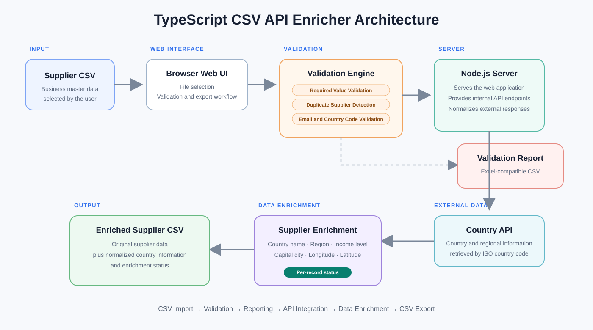
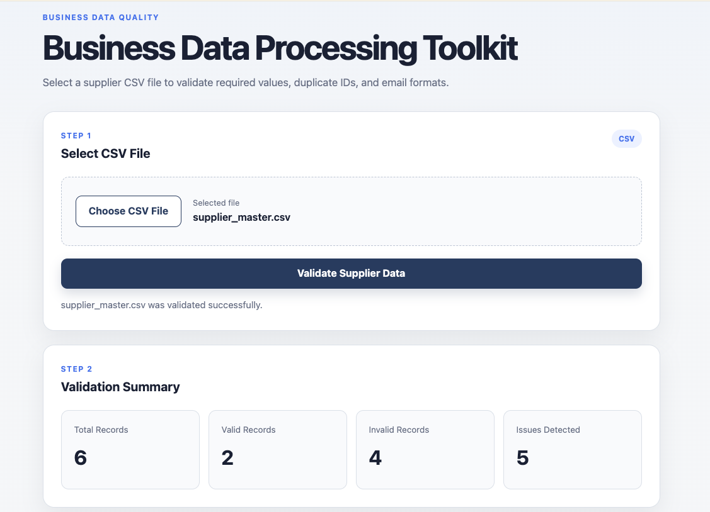
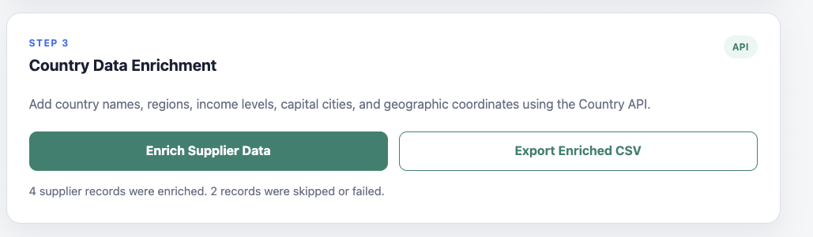
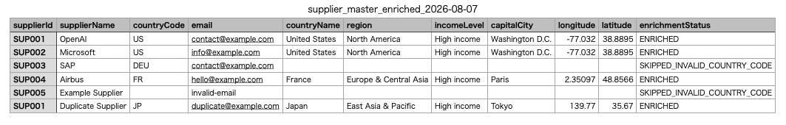

# TypeScript CSV API Enricher

Business-oriented TypeScript toolkit for CSV validation, external API integration, and data enrichment.

Built for operations teams that need to process business master data safely, detect data-quality issues, enrich records with external reference data, and export reusable validation and enriched CSV files.

The current implementation provides an end-to-end browser-based workflow for supplier master data.

---

## Architecture

<p align="center">
  
</p>

---

## Screenshots

### Supplier Data Validation

<p align="center">
  
</p>

The browser interface validates supplier master data and provides a summary of total, valid, invalid, and detected issue counts.

### Country Data Enrichment

<p align="center">
  
</p>

Validated supplier records can be enriched with external country information through the Country API.

The enrichment process continues even when individual records contain invalid or missing country codes.

### Enriched CSV Output

<p align="center">
  
</p>

The exported CSV preserves the original supplier data and adds normalized country information together with a per-record enrichment status.

---

## Features

### CSV Processing

✓ Browser-based CSV file selection

✓ Supplier master CSV import

✓ Cross-platform file handling

✓ CSV parsing and structured data mapping

✓ UTF-8 CSV export with BOM support

✓ Reusable supplier data model

### Data Validation

✓ Required-value validation

✓ Duplicate supplier ID detection

✓ Email format validation

✓ Two-letter country-code format validation

✓ Multiple issues per record

✓ Valid / invalid record counting

✓ Validation issue summary

✓ Detailed validation issue display

### Validation Report

✓ Validation report CSV export

✓ Source row tracking

✓ Validation rule identification

✓ Field-level issue reporting

✓ Supplier ID tracking

✓ Human-readable error messages

### Country API Integration

✓ Node.js API server

✓ External country information API integration

✓ ISO two-letter country-code lookup

✓ Country information normalization

✓ API implementation isolated from application models

✓ Graceful handling of invalid country codes

✓ Graceful handling of API failures

### Data Enrichment

✓ Country name enrichment

✓ Region enrichment

✓ Income-level enrichment

✓ Capital-city enrichment

✓ Longitude enrichment

✓ Latitude enrichment

✓ Per-record enrichment status

✓ Invalid records skipped without stopping the full process

✓ Enriched supplier CSV export

### Web Interface

✓ Browser-based workflow

✓ Responsive layout

✓ CSV file selection

✓ Validation summary dashboard

✓ Detailed validation issue display

✓ Validation report export

✓ Country data enrichment

✓ Enriched CSV export

✓ Processing status messages

---

## End-to-End Workflow

```text
Supplier CSV
      │
      ▼
CSV Import
      │
      ▼
Supplier Data Model
      │
      ▼
Validation Engine
      │
      ├── Required Value Validation
      ├── Duplicate Supplier ID Detection
      ├── Email Format Validation
      └── Country Code Format Validation
      │
      ▼
Validation Summary
      │
      ├── Total Records
      ├── Valid Records
      ├── Invalid Records
      └── Issues Detected
      │
      ├──────────────────────► Validation Report CSV
      │
      ▼
Country Data Enrichment
      │
      ▼
Node.js API Server
      │
      ▼
External Country API
      │
      ▼
Country Information Normalization
      │
      ├── Country Name
      ├── Region
      ├── Income Level
      ├── Capital City
      ├── Longitude
      └── Latitude
      │
      ▼
Enriched Supplier Data
      │
      ▼
Enriched CSV Export
```

---

## Validation Rules

The current version supports the following validation rules.

| Rule | Description |
|---|---|
| `REQUIRED_VALUE` | Detects required fields with missing values |
| `DUPLICATE_SUPPLIER_ID` | Detects duplicate supplier IDs |
| `INVALID_EMAIL_FORMAT` | Detects malformed email addresses |
| `INVALID_COUNTRY_CODE_FORMAT` | Detects country codes that are not two-letter alphabetic codes |

Country-code format validation intentionally checks only the input format.

Whether a valid two-letter code can be resolved to country information is handled separately by the API enrichment process.

---

## Validation Example

The included sample supplier data intentionally contains several data-quality issues.

```text
Total records: 6
Valid records: 2
Invalid records: 4
Issues detected: 5
```

Detected issues:

```text
Row 2 | DUPLICATE_SUPPLIER_ID
Row 4 | INVALID_COUNTRY_CODE_FORMAT
Row 6 | REQUIRED_VALUE
Row 6 | INVALID_EMAIL_FORMAT
Row 7 | DUPLICATE_SUPPLIER_ID
```

This sample demonstrates that multiple validation rules can be applied to the same CSV dataset before enrichment begins.

---

## Validation Report

Validation issues can be exported as an Excel-compatible CSV report.

The report contains:

```text
Row
Rule
Field
Supplier ID
Message
```

Example:

```text
Row 2 | DUPLICATE_SUPPLIER_ID | supplierId | SUP001
Row 4 | INVALID_COUNTRY_CODE_FORMAT | countryCode | SUP003
Row 6 | REQUIRED_VALUE | countryCode | SUP005
Row 6 | INVALID_EMAIL_FORMAT | email | SUP005
Row 7 | DUPLICATE_SUPPLIER_ID | supplierId | SUP001
```

This provides a reusable issue list for correction, review, or operational follow-up.

---

## Country Data Enrichment

After validation, supplier records can be enriched using external country information.

For valid country codes, the application retrieves and normalizes:

```text
Country Name
Region
Income Level
Capital City
Longitude
Latitude
```

Example:

```text
Country Code: US
Country Name: United States
Region: North America
Income Level: High income
Capital City: Washington D.C.
Longitude: -77.032
Latitude: 38.8895
```

The API-specific response structure is isolated from the application's internal data model.

This allows the external provider to be replaced or extended without tightly coupling the rest of the application to one API response format.

---

## Enrichment Status

Each exported supplier record includes an `enrichmentStatus` field.

| Status | Description |
|---|---|
| `ENRICHED` | Country information was retrieved successfully |
| `SKIPPED_INVALID_COUNTRY_CODE` | Enrichment was skipped because the country code was missing or invalid |
| `API_ERROR` | A valid-format country code could not be enriched because the API request failed |

A failed or invalid record does not stop enrichment of the remaining supplier records.

For the included sample:

```text
4 supplier records were enriched.
2 records were skipped or failed.
```

This fail-safe approach allows batch processing to continue while preserving the processing result for every supplier record.

---

## Enriched CSV

The enriched CSV contains the original supplier fields plus normalized country information.

```text
supplierId
supplierName
countryCode
email
countryName
region
incomeLevel
capitalCity
longitude
latitude
enrichmentStatus
```

Example enriched record:

```text
SUP001
OpenAI
US
contact@example.com
United States
North America
High income
Washington D.C.
-77.032
38.8895
ENRICHED
```

Records that cannot be enriched remain in the exported CSV with an appropriate `enrichmentStatus`.

---

## Use Cases

### Supplier Master Validation

- Detect missing supplier information
- Identify duplicate supplier IDs
- Validate country-code formats
- Validate email formats
- Prepare supplier data for system migration

### Procurement Operations

- Enrich supplier data with country information
- Standardize procurement master records
- Generate reusable validation reports
- Reduce manual spreadsheet checking

### Data Migration

- Validate CSV files before system import
- Identify incomplete or malformed records
- Track invalid records and validation reasons
- Enrich reference data before migration

### Back-office Automation

- Replace repetitive spreadsheet checks
- Create repeatable data-processing workflows
- Produce standardized CSV outputs
- Separate validation from external API processing

---

## Web Workflow

### Step 1 — Select CSV File

Select a supplier master CSV file from the browser.

The application reads the selected file and converts the CSV rows into structured Supplier records.

### Step 2 — Validate Supplier Data

Run the validation engine.

The interface displays:

- Total Records
- Valid Records
- Invalid Records
- Issues Detected
- Detailed validation issues

A validation report can then be exported as CSV.

### Step 3 — Enrich Supplier Data

Select:

```text
Enrich Supplier Data
```

The application sends valid-format country codes through the Node.js server to the external Country API.

Country information is normalized and added to each supplier record.

Invalid country-code records are skipped without interrupting enrichment of the remaining records.

### Step 4 — Export Enriched CSV

After enrichment, select:

```text
Export Enriched CSV
```

The application downloads the enriched supplier master as an Excel-compatible CSV file.

---

## Getting Started

### Requirements

- Node.js
- npm
- Modern web browser

### Install Dependencies

```bash
npm install
```

### Start the Application

```bash
npm run dev
```

Open the local application in your browser.

```text
http://localhost:3000
```

---

## Development Commands

### Compile TypeScript

```bash
npm run build
```

### Build Browser JavaScript

```bash
npm run build:web
```

### Start Compiled Server

```bash
npm run start
```

### Build and Start Development Environment

```bash
npm run dev
```

---

## Cross-Platform Design

The project is designed to provide the same user workflow on Windows and macOS.

Platform-specific technical choices are handled internally rather than requiring users to select an operating system or implementation method.

Examples include:

- Browser-based CSV file selection
- Node.js path handling
- Platform-independent application commands
- Browser-based CSV export
- Standard UTF-8 data processing

The design prioritizes a consistent user experience rather than forcing identical low-level file-system behavior across operating systems.

---

## Technical Design

### TypeScript

The project uses strict TypeScript typing for business data, validation results, API responses, and enriched records.

External API response structures are kept separate from internal application models.

### Validation Layer

Validation rules are implemented independently from the browser interface.

This allows the validation engine to remain reusable and easier to extend.

### API Layer

External country API communication is isolated behind a dedicated API adapter.

The rest of the application works with normalized internal country information rather than depending directly on an external response structure.

### Web Layer

The browser interface handles:

- File selection
- Validation execution
- Result rendering
- Validation report export
- API enrichment requests
- Enriched CSV export

### Server Layer

The Node.js server:

- Serves the browser application
- Provides internal API endpoints
- Communicates with the external Country API
- Normalizes external country information

---

## Repository Structure

```text
typescript-csv-api-enricher/

├── images/
│   ├── architecture.svg
│   ├── enriched-csv-output.png
│   ├── web-country-enrichment.png
│   └── web-validation-summary.png
│
├── public/
│   ├── index.html
│   ├── style.css
│   └── app.js
│
├── samples/
│   └── supplier_master.csv
│
├── src/
│   ├── api/
│   │   └── countryApi.ts
│   │
│   ├── types/
│   │   ├── country.ts
│   │   ├── enrichedSupplier.ts
│   │   ├── supplier.ts
│   │   └── validation.ts
│   │
│   ├── validation/
│   │   └── supplierValidator.ts
│   │
│   ├── web/
│   │   └── app.ts
│   │
│   ├── index.ts
│   └── server.ts
│
├── .gitignore
├── LICENSE
├── package.json
├── package-lock.json
├── README.md
└── tsconfig.json
```

Generated folders such as `node_modules/` and `dist/` are excluded from version control.

---

## Architecture Principles

### Separation of Responsibilities

CSV parsing, validation, API communication, server behavior, web UI, and data models are kept in separate modules.

### Fail-Safe Batch Processing

A single invalid supplier record does not prevent valid records from being processed.

### External API Isolation

External service-specific response formats remain inside the API layer.

### User-Oriented Cross-Platform Behavior

Operating-system differences are handled by the application wherever possible instead of exposing technical choices to the user.

### Reusable Business Models

Supplier, validation, country, and enrichment data are represented using explicit TypeScript models.

---

## Future Roadmap

### v0.2

- Country API response caching
- Improved API error classification
- Enrichment progress indicator
- Additional validation rules
- Automated tests for validation and enrichment

### v0.3

- Configurable CSV column mapping
- Additional master-data formats
- Configurable validation rules
- Batch processing improvements

### v0.4

- Additional external data providers
- API provider abstraction
- Retry and timeout policies
- Processing audit logs

### v0.5

- Drag-and-drop CSV import
- Advanced validation dashboard
- Downloadable processing summary
- Larger dataset optimization

---

## Current Version

**v0.1**

Released: **2026-08-07**

Status: **Stable Release**

Core workflow:

```text
CSV Import
→ Validation
→ Validation Report
→ External API Integration
→ Data Enrichment
→ Enriched CSV Export
```

---

## License

MIT License
